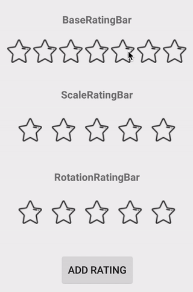
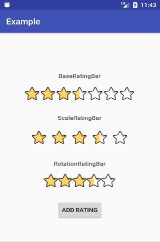

# SimpleRatingBar

>This is a very simple RatingBar library, which you can just simply extend BaseRatingBar to implement your own animation RatingBar in a few steps!

Current we already have three RatingBars :
- BaseRatingBar  
    A RatingBar without any animation.
- ScaleRatingBar  
    A RatingBar with progressive and scale animation.
- RotationRatingBar (contributed by [nappannda](https://github.com/nappannda))  
    A RatingBar with progressive and rotate animation.

## Demo
  
  
Icon made by [Freepik](http://www.freepik.com/) from www.flaticon.com 

